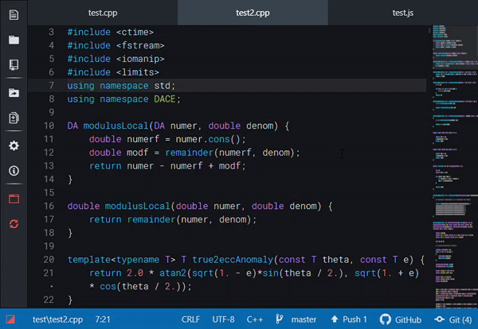

# Quick Fold

[](https://travis-ci.com/binaryfunt/quick-fold)

Press <kbd>Ctrl</kbd>+<kbd>Alt</kbd>+<kbd>f</kbd> to fold the next foldable line in Atom. Useful for quickly folding many function declarations, for example.



> Other packages used in the above screen capture: [Threshold UI](https://atom.io/themes/threshold-ui), [Convergent Syntax](https://atom.io/themes/convergent-syntax), [Tool Bar](https://atom.io/packages/tool-bar) with [Flex Tool Bar](https://atom.io/packages/flex-tool-bar), and [Minimap](https://atom.io/packages/minimap)


## Installation

### In Atom

1. Go to `File > Settings`
1. Click "+ Install"
1. Search for "quick-fold"
1. On "quick-fold", click the "Install" button

### Command line

```
apm install quick-fold
```
